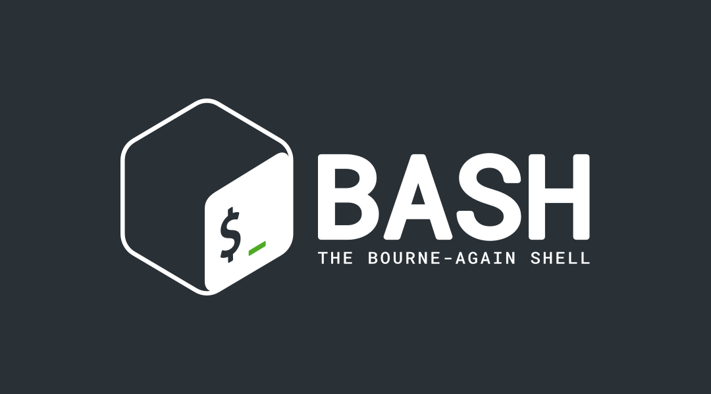

<p align="center">

</p>
<h1 align="center">Saying Hello</h1>

The “Hello, World” program is the first program you learn
to write in many languages, but it doesn’t involve any input.
So create a program that prompts for your name and prints
a greeting using your name.

## Example Output

```
 What is your name? Brian
 Hello, Brian, nice to meet you!
```

## Constraint

- Keep the input, string concatenation, and output sepa-
rate.

<!-- ## Challenges

- Write a new version of the program without using any variables. -->
